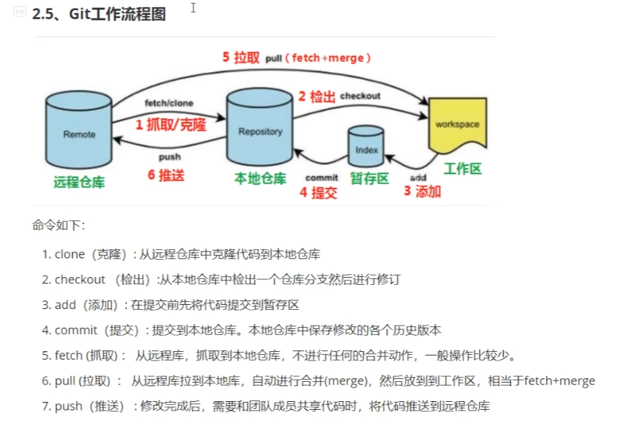

备份，代码还原，协同开发，追溯问题代码的编写人和编写时间

# 版本控制的方式

1. 集中式版本控制工作

   ​	集中式版本控制工具，版本是集中存放在中央服务器的，team里每个人work是从中央服务器下载代码，是必须联网才能工作，局域网或互联网，个人修改后然后提交到中央版本库

2. 分布式版本控制工具

   ​	分布式版本控制系统没有中央服务器，每个人的电脑上都是一个完整的版本库，这样工作的时候，无需要联网，因为版本库就在自己的电脑上。多人写作只需要各自的修改推送给对方，就能互相看到对方的修改了。

## Git

