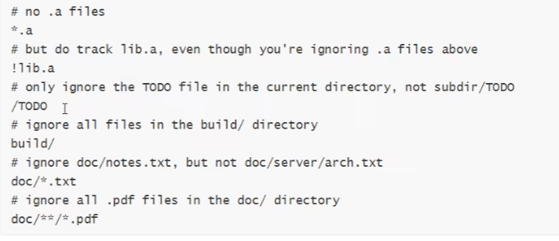
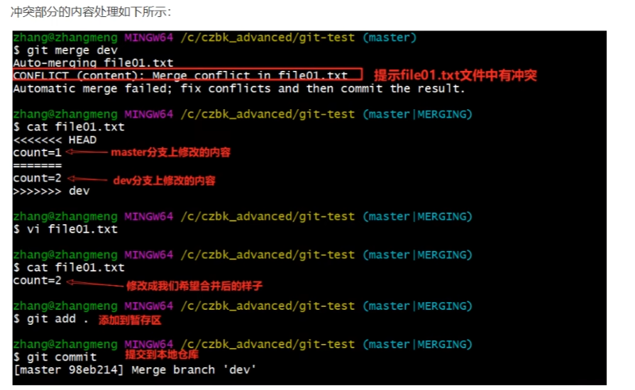
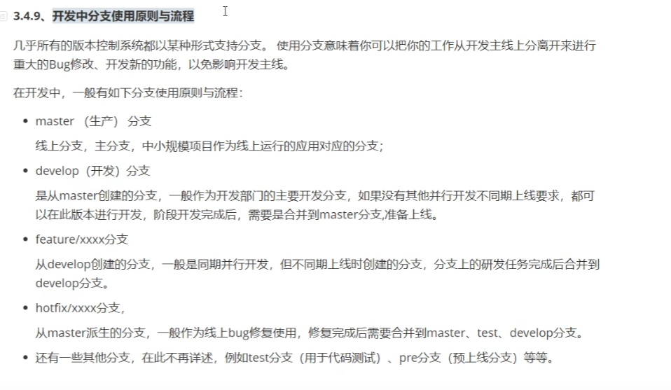
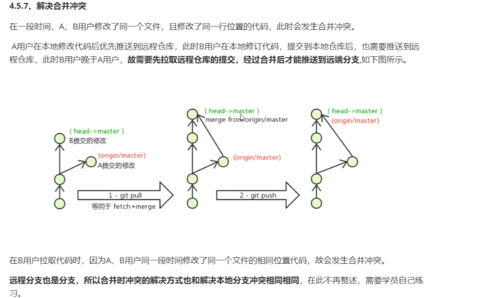
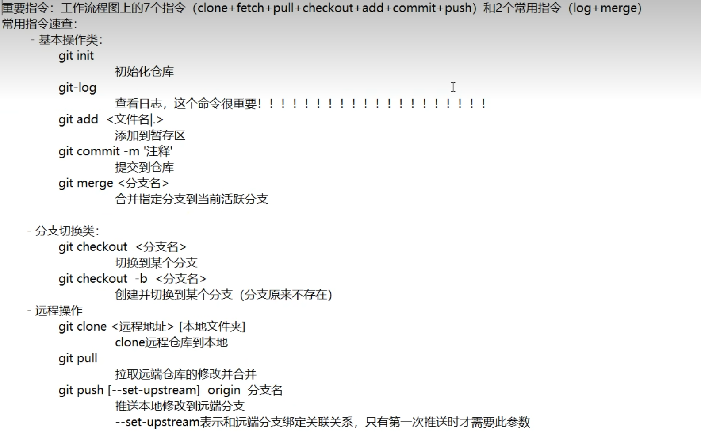

备份，代码还原，协同开发，追溯问题代码的编写人和编写时间

# 版本控制的方式

1. 集中式版本控制工作

   ​	集中式版本控制工具，版本是集中存放在中央服务器的，team里每个人work是从中央服务器下载代码，是必须联网才能工作，局域网或互联网，个人修改后然后提交到中央版本库

2. 分布式版本控制工具

   ​	分布式版本控制系统没有中央服务器，每个人的电脑上都是一个完整的版本库，这样工作的时候，无需要联网，因为版本库就在自己的电脑上。多人写作只需要各自的修改推送给对方，就能互相看到对方的修改了。

## Git

# 获取本地仓库

创建本地仓库

1. 在任意位置创建一个空目录，作为我们的本地Git仓库
2. 在进入这个目录中，点击右键打开Git bash窗口
3. 执行命令git init
4. 如果创建成功后可以再文件夹下看到隐藏的.git目录

# 基础操作指令

随着对于Git工作目录下的文件进行修改，随着执行的GIt命令，状态该发生变化

1. git add (工作区->暂存区)

2. git commit -m "注释内容"(暂存区->本地仓库)

3. git status 查看文件状态

4. git log [option]查看提交的记录

   1. --all 显示所有分支
   2. --pretty=oneline 将提交信息显示为一行
   3. --graph 以图的形式显示

5. git  reset --hard commitID

   1. commitID可以使用git-log或git log指令查看
   2. git relog 可以查看已经删除的提交记录

6. 设置不需要git管理的文件，需要将文件添加到.gitignore里面

   

# Git分支常用命令

分支意味着把工作从开发主线上分离开进行中的的Bug修改，开发新的功能，以免影响开发主线

1. git branch查看分支
2. git branch 分支名 创建分支
3. git checkout 分支名 切换分支
   1. git checkout -b 分支名 创建一个不存在的分支名并切换（创建并切换）
4. git merge 分支名称 合并分支，一个分支上的提交可以合并到另一个分支
5. git branch -d b1 删除分支是，需要做各种检查
   1. git branch -D b1 不做任何检查，强制删除
   2. 不能删除当前分支，只能删除其他分支

# 解决冲突

当两个分支上对文件的修改可能会存在冲突，例如同时修改了同一个文件的同一行，这时候就需要手动解决冲突，解决冲突步骤如下：

1. 处理文件中冲突的地方
2. 将解决完冲突的问价加入暂存区（add）
3. 提交到仓库(commit)

# 分支使用流程

 

# 仓库托管·注册·创建仓库·配置公钥

## 常用的托管服务（远程仓库）

比较常用的远程仓库有GitHub,码云,GitLab等

gitHub是一个面向开源以及私有软件项目的托管平台，因为只支持Git作为唯一的版本库哥是进行托管，故名未gitHub

码云：过内的一个代码拖馆平台，由于服务器在国内，所有相比于GitHub,码云速度会更快

GitLab是一个用于仓库管理系统的开源项目，使用git 作为代码管理工具，并在此基础上搭建起来web服务，一般用于在企业，学校内部网络搭建git私服

## 生成公钥

ssh-keygen-t rsa 一直回车

cat ~/.ssh/id_rsa.pub 获取公钥

# 远程仓库添加·查看·推送

1. 添加远程仓库
   1. git remote add <远端名称> <仓库路径>
   2. git remote add origin 远程仓库地址
2. git remote 查看远程仓库
3. 推送到远程仓库
   1. git push [-f] [--set-upstream] [远端名称] [本地分支名]:[远端分支名]
   2. -f表示强制覆盖
   3. git push origin master

4. 本地分支与远程分支的关联关系

   git branch -vv

 

# 从远程仓库克隆：

1. git clone <仓库路径> <本地目录>

# 抓取和拉取

​	远程分支和本地分支一样，我们可以进行merge操作，只需要先把远端仓库里的更新都下载到本地，再进行操作

1. 抓取命令：git fetch [remote name] [branch name]

   抓取指令就是将仓库里的更新都抓取到本地，不会进行合并

   如果不指定远端命令和分支名，则抓取所有分支

2. 拉取命令：git pull [remote name] [branch name]

   拉取指令就是将远端仓库的修改拉到本地并自动进行合并，等同于fetch+merge

   如果不指定远端名称和分支名，则抓取所有并更新当前分支

# 解决和并冲突

# Git在IDEA中的使用

# 常用指令速查

