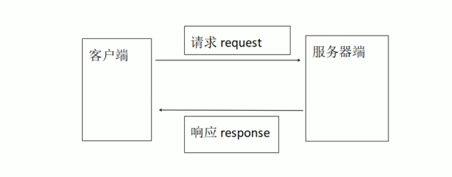

# 一.HTTP

**Http**：无状态协议，是互联网中使用 Http 实现计算机和计算机之间的请求和响应

- Http 使用纯文本方式发送和接收协议数据，不需要借助专门工具进行分析就可以知道协议中数据

**Http 报文 (message) 组成部分**

- 请求行 (request-line)
- 请求头 (head)
- 请求体 (body)
- 响应头
- 响应体

**HTTP 1.1 实现了多种请求方式**

- GET：向服务器请求资源地址
- HEAD：只要求响应头
- POST：直接返回请求内容
- PUT：创建资源
- DELETE：删除资源
- TRACE：返回请求本身
- OPTIONS：返回服务器支持 HTTP 方法列表
- CONNECT：建立网络连接
- PATCH：修改资源

**软件模型**

- B/S 结构：客户端浏览器 / 服务器，客户端是运行在浏览器中
- C/S 结构：客户端 / 服务器，客户端是独立的软件

HTTP POST 简易模型图




# Go语言对GTTP支持

- 在Golang的net/http包提供了HTTP客户端和服务端的视线
- HadnleFunc()可以设置函数的请求路径

```go
func HadnleFunc(pattern string,handler func(ResponseWriter,*Request)){
    DefaultServeMux.HadnleFunc(pattern,handle)
}
```

- ListenAndServer实现了监听服务

```go
func ListenAndServer(addr string,handler:handler)error{
    server:=&server{Addr:addr,handler:handler}
    return server.ListenAndServer()
}
```


# 第一个Go Web项目

```go
package main

import (
	"fmt"
	"net/http"
)

func Welcome(w http.ResponseWriter, r *http.Request) {
	w.Header().Set("Content-Type", "text/html;charset=utf-8")
	fmt.Fprintln(w, "服务器返回的信息<b>加粗</b>")
}
func main() {
	http.HandleFunc("/abc", Welcome)
	http.ListenAndServe("localhost:8081", nil)
}

```

