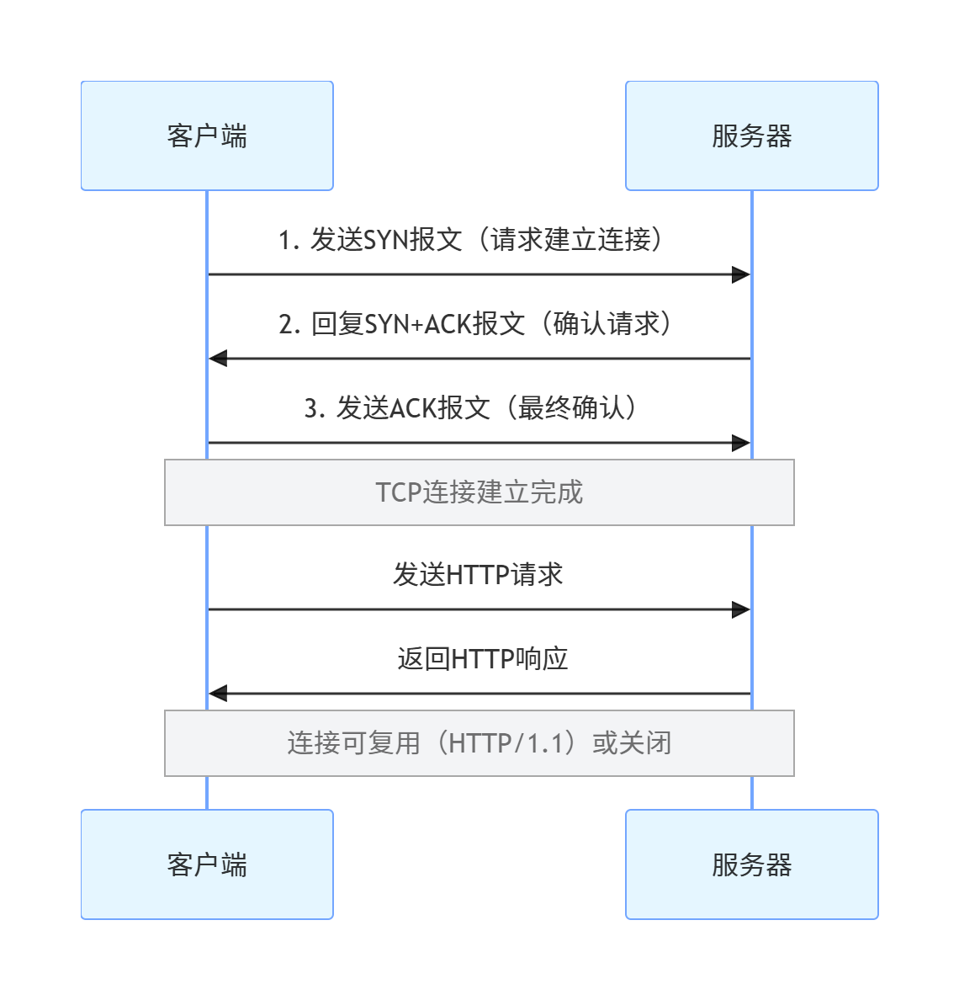
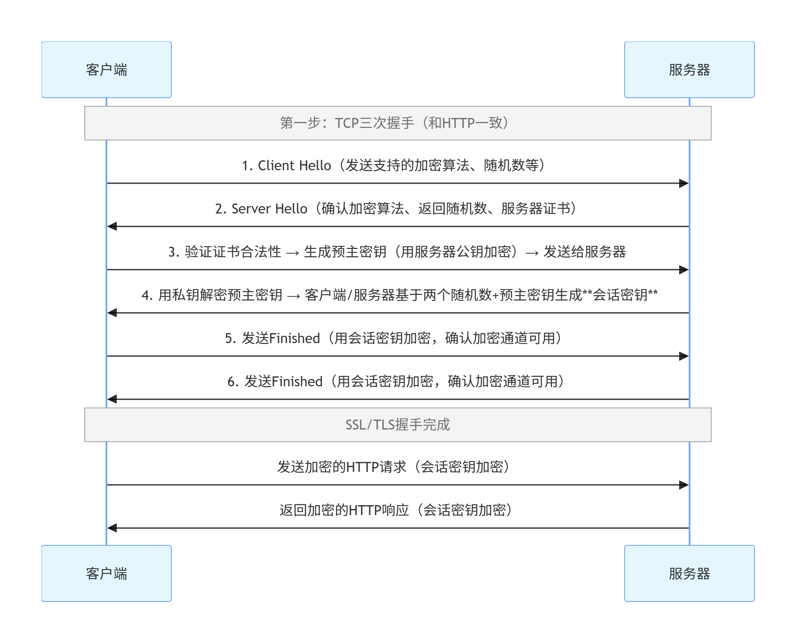

​	想要系统理解 HTTP 协议的核心原理、请求响应结构，以及 HTTP 和 HTTPS 的核心区别与各自的建立过程，我会从基础到进阶，用通俗易懂的方式把这些知识点讲清楚

# 一、HTTP协议核心基础

​	

## 1.什么是HTTP

​	HTTP（HyperText Transfer Protocol，超文本传输协议）是**客户端和服务器之间通信的规则**，主要用于在 Web 上传输超文本（比如 HTML、图片、视频等），是互联网的核心协议之一。

- 核心特点：基于 TCP/IP、无状态（服务器不会记住客户端的前一次请求）、明文传输、应用层协议。

## 2.HTTP请求与响应的结构

### （1）HTTP 请求结构（客户端→服务器）

一个完整的 HTTP 请求由 4 部分组成，格式如下：

```
请求行 → 方法 路径 协议版本（如 GET /index.html HTTP/1.1）
请求头 → Key: Value 形式（如 Host: www.baidu.com、User-Agent: Chrome/120）
空行 → 分隔请求头和请求体
请求体 → 可选（POST请求的参数会放在这里，GET请求无请求体）
```

**示例（GET 请求）**：

```
GET /api/user HTTP/1.1
Host: example.com
User-Agent: Mozilla/5.0 (Windows NT 10.0; Win64; x64)
Accept: */*

# 空行后无请求体
```

**示例（POST 请求）**：

```
POST /api/login HTTP/1.1
Host: example.com
Content-Type: application/json
Content-Length: 36

{"username":"test","password":"123456"}  # 请求体
```

### （2）HTTP 响应结构（服务器→客户端）

同样由 4 部分组成：

```
状态行 → 协议版本 状态码 状态描述（如 HTTP/1.1 200 OK）
响应头 → Key: Value 形式（如 Content-Type: text/html、Server: Nginx）
空行 → 分隔响应头和响应体
响应体 → 服务器返回的实际内容（如HTML页面、JSON数据）
```

**示例**：

```
HTTP/1.1 200 OK
Content-Type: application/json
Content-Length: 28
Server: Nginx/1.20.1

{"code":200,"msg":"登录成功"}  # 响应体
```

# 二、HTTP vs HTTPS 核心区别

HTTPS 不是新协议，而是**HTTP + SSL/TLS** 的组合（HTTP over SSL/TLS），核心是给 HTTP 加了加密层，两者的关键区别如下：

| 对比维度 |             HTTP              |               HTTPS                |
| :------: | :---------------------------: | :--------------------------------: |
|  安全性  | 明文传输，数据易被窃听 / 篡改 |         加密传输，数据安全         |
|   端口   |         默认 80 端口          |           默认 443 端口            |
|  协议层  |         直接基于 TCP          |      TCP + SSL/TLS（加密层）       |
|   证书   |           无需证书            |       需 CA 颁发的 SSL 证书        |
|   性能   |      无加密开销，速度快       | 加密解密有开销，速度稍慢（可优化） |
| 核心作用 |         普通数据传输          |    敏感数据传输（支付、登录等）    |


# 三、HTTP/HTTPS 连接建立过程

## 1. HTTP 连接建立（基于 TCP）

HTTP 基于 TCP 的 “三次握手” 建立连接，流程极简：



- 特点：三次握手后直接传输明文数据，无任何加密步骤。

## 2.HTTPS 连接建立（TCP + SSL/TLS 握手）

HTTPS 需要先完成 TCP 三次握手，再进行 SSL/TLS 握手（加密协商），完整流程：



#### 关键步骤解释：

- **证书验证**：客户端确认服务器证书是 CA 颁发的，防止 “中间人攻击”；
- **会话密钥生成**：客户端和服务器协商出唯一的 “会话密钥”（对称加密），后续数据传输都用这个密钥加密（对称加密效率远高于非对称加密）；
- 核心目的：确保数据传输过程中，只有客户端和服务器能解密，第三方无法窃取 / 篡改。

# 总结

1. **HTTP 核心**：应用层协议，明文传输，基于 TCP 三次握手建立连接，请求 / 响应由 “行 + 头 + 空行 + 体” 组成；

2. **HTTPS 本质**：HTTP + SSL/TLS，在 TCP 握手后增加 SSL/TLS 加密协商，通过证书和会话密钥实现数据加密；

3. **核心区别**：HTTPS 多了加密层和证书验证，安全性高，适用于敏感场景，HTTP 则更轻便但无安全保障。