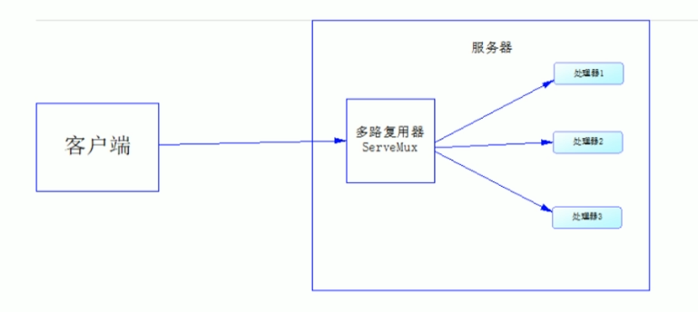

# 一、restful

- 在目前所学内容中每个请求都是需要绑定一个HandlerFunc,e而在实际项目中会有很多URL,且可能出现满足特定规律的URL,例如：sxt/it和sxt/baizhan都是以/sxt/开头，且如果这两个URL里面代码也差不多是，写两个Func就属于代码冗余了
- 可以使用restful风格吧满足特定格式url和功能类似的代码提入到一个func中实现代码复用。


# 二、Go语言的多路复用器

- 在http包中提供了ServeMux实现多路复用器，它会对URL进行解析，然后重定向到正确的处理器上



- ServeMux是一个结构体，里面存放了map和读写锁

- `ServeMux`是一个结构体，里面存放了`map`和读写锁

```go
type ServeMux struct {
    mu    sync.RWMutex
    m     map[string]muxEntry
    hosts bool // whether any patterns contain hostnames
}
```

- 在 Go 语言中有提供了`ServeMux`的对象`DefaultServeMux`

```go
var DefaultServeMux = &defaultServeMux
var defaultServeMux ServeMux
```


# 三、使用第三方实现Restful风格

- 可以使用命令，从github上下载第三方库，下载到%GOROOT%/src/github.com中

```
go get github.com/gorilla/mux
```

- 使用mux包的Router实现Restful风格

```go
package main

import (
    "net/http"
    "fmt"
    "github.com/gorilla/mux"
)

func hello(w http.ResponseWriter, r *http.Request) {
    vars := mux.Vars(r)
    fmt.Fprintln(w, "dayinle", vars["key"])
}

func abc(w http.ResponseWriter, r *http.Request) {
    fmt.Fprintln(w, "abc")
}

func main() {
    r := mux.NewRouter()
    r.HandleFunc("/hello/{key}", hello)
    r.HandleFunc("/abc", abc)
    http.ListenAndServe(":8090", r)
    // s := http.Server{Addr:":8090", Handler:r}
    // s.ListenAndServe()
}
```

