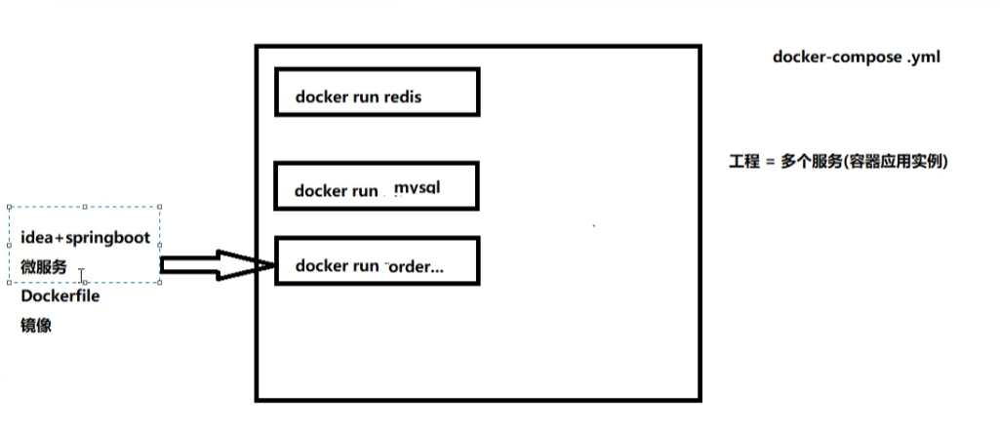

# Docker Compose

compose是Docker容器官方的开源项目，负责实现对Docker容器集群的快速编排。

Compose是Docker公司退出的一个工作软件，可以管理多个Docker容器组成一个应用，需要定义一个YAML格式的配置文件docker-compose.yml,写好多个容器之间的调用关系，然后只要一个命令，就能同时启动和关闭这些容器。


## compose下载

都要在root用户模式下执行

```
1. curl -L "https://github.com/docker/compose/releases/download/v2.2.2/docker-compose-$(uname -s)-$(uname -m)" -o /usr/local/bin/docker-compose
v2.2.2为版本号可替换
将可执行权限应用于二进制文件
2. chmod +x /usr/local/bin/docker-compose
创建软链
3.ln -s /usr/local/bin/docker-compose /usr/bin/docker-compose
测试是否成功
4. docker-compose version
cker-compose version 1.24.1(版本号)
```

想要卸载Docker Compose

```
rm /url/local/bin/docker-compose
```


## compose概念

### 一个文件

docker-compose.yml


### 两大要素

服务(service):

一个个应用容器实例，比如订单微服务，库存微服务，mysql容器,nginx容器或者redis容器

工程(project)：

有一组关联的应用容器组成的一个完整业务单元，在docker-compose.yml文件中定义




## Compose的使用

```
1. 编写Dockerfile定义各个微服务应用并构建出对应的镜像文件

2. 使用 docker-compose.yml，定义一个完整业务单元，安排好整体应用中的各个容器服务。

3. 最后，执行docker-compose up命令，来启动并运行整个应用程序，完成一键部署上线
```


## Compose常用命令

| 命令                           | 说明                                                         |
| :----------------------------- | :----------------------------------------------------------- |
| `docker-compose[h]`            | 查看帮助                                                     |
| `docker-compose up`            | 启动所有docker-compose服务                                   |
| `docker-compose up -d`         | 启动所有docker-compose服务并后台运行                         |
| `docker-compose down`          | 停止并删除容器、网络、卷、镜像                               |
| `docker-compose exec <服务id>` | 进入容器实例内部 `docker-compose exec docker-compose.yml文件中写的服务id /bin/bash` |
| `docker-compose ps`            | 展示当前docker-compose编排过的运行的所有容器                 |
| `docker-compose top`           | 展示当前docker-compose编排过的容器进程                       |
| `docker-compose logs <服务id>` | 查看容器输出日志                                             |
| `docker-compose config`        | 检查配置                                                     |
| `docker-compose config -q`     | 检查配置，有问题才有输出                                     |
| `docker-compose restart`       | 重启服务                                                     |
| `docker-compose start`         | 启动服务                                                     |
| `docker-compose stop`          | 停止服务                                                     |