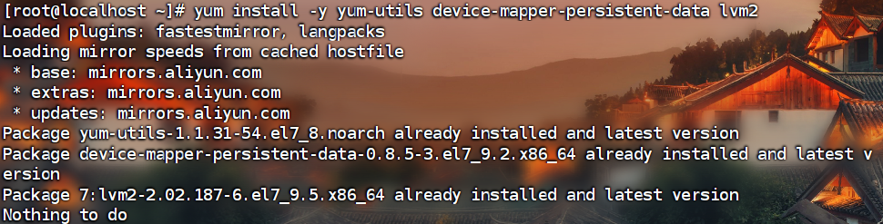
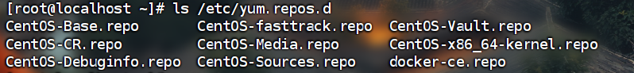
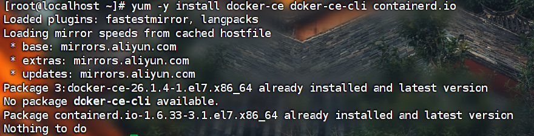

# Docker安装及问题解决

## 前言

对于学习Docker,首先安装Docker是必要的，在这里分享一下我的一些安装历程吧，这其中包含了我在安装过程中出现的一些问题，以及解决方法


## Docker的安装

### 1.安装docekr依赖环境：

```
yum install -y yum-utils device-mapper-persistent-data lvm2
```

我安装过显示界面如下：

### 2.配置Docker -ce

```
yum-config-manager --add-repo http://mirrors.aliyun.com/docker-ce/linux/centos/docker-ce.repo
```

上述命令就是进行yum源的添加

查看是否成功：

```
ls /etc/yum.repos.d
```



显示内容中有docker -ce.repo就是成功了


## 3.安装docker

```
yum -y install docker-ce doker-ce-cli containerd.io
```



我这是安装过的执行显示的内容。

在安装的时候，会出现：Error response from daemon: Get “https://registry-1.docker.io/v2/“: net/http: request canc

这个错误是我，遇到的，我在后面会给我解决方案


## 4.关闭防火墙

关闭防火墙这一步，我一般是关闭的，要不然后续的一些操作会受影响

```
iptables -nL #查看一下iptable规则，关闭防火墙后会自动插入新规则

systemctl stop firewalld && systemctl disable firewalld  #关闭防火墙

sysctlrem restart docker # 关闭防火墙要把docker重启一下，不然docker
的ip包转发功能无法使用。即便防火墙关闭了，docker依旧会调用内核模块netfilter增加规则，所以会新增iptables规则

```


## Docker的问题解决

上文提到的出现Error:

```
Error response from daemon: Get “https://registry-1.docker.io/v2/“: net/http: request canc
```

该报错，可能是应为镜像访问太慢，导致超时了，然后尝试换镜像

下面是解决方案：

进入/etc/docker/daemon.json文件中进行编辑

写入以下内容：

```
{
  "registry-mirrors": ["https://docker.registry.cyou",
"https://docker-cf.registry.cyou",
"https://dockercf.jsdelivr.fyi",
"https://docker.jsdelivr.fyi",
"https://dockertest.jsdelivr.fyi",
"https://mirror.aliyuncs.com",
"https://dockerproxy.com",
"https://mirror.baidubce.com",
"https://docker.m.daocloud.io",
"https://docker.nju.edu.cn",
"https://docker.mirrors.sjtug.sjtu.edu.cn",
"https://docker.mirrors.ustc.edu.cn",
"https://mirror.iscas.ac.cn",
"https://docker.rainbond.cc"]
}
```

然后重新启动一下docker

```
systemctl daemon-reload

systemctl restart docker
```

问题应该就解决了