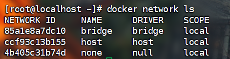

# docker network

docker 不启动，默认网络情况中包含ens33、lo、virbr0

docker启动后，网络情况:docker0

## docker网络模式命令：

默认创建三大网络模式

### docker network create 网络名

用于新建一个网络

### docker network rm 网络名

删除一个网络

### docker network inspect 网络名

查看网络数据源

## docker network能干啥

容器间的互联和通信以及端口映射

容器ip变动的时候可以通过服务名直接网络通信而不受到影响

## 网络模式

**bridge:**

为每一个容器分配、设置IP等，并将容器连接到一个docker0，虚拟网桥默认为该模式

使用network bridge制定，默认使用docker0

**host** :

容器将不会虚拟出自己的网卡，配置自己的ip等，而是使用宿主机的ip和端口

**none :**

容器有独立的Network,namespace,DNA并没有对其进行任何网络设置，如分配veth pair和网络桥连接，IP等

**container:**

新创建的容器不会创建自己的网卡和配置自己的IP,而是和一个指定的容器共享IP、端口范围等

使用network container:NAME或者容器ID指定