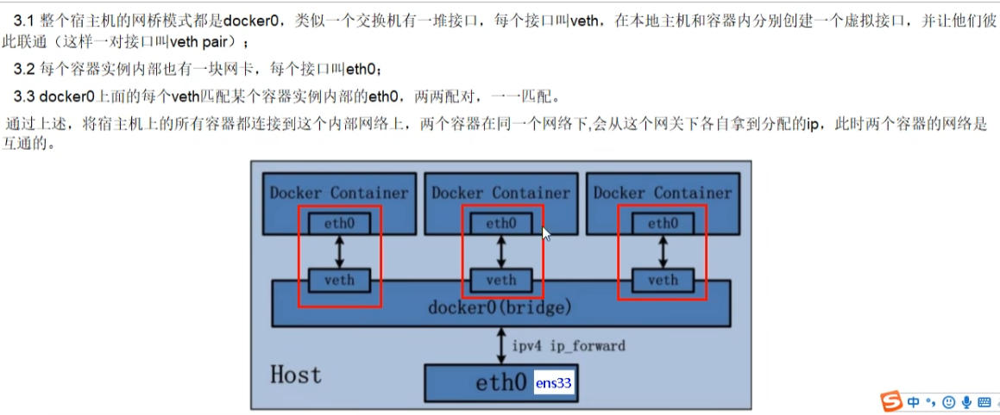
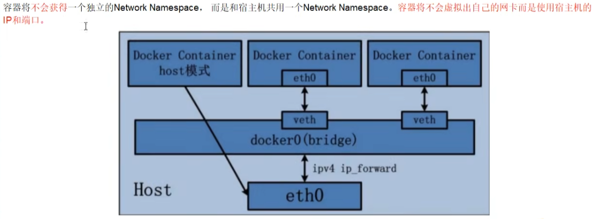
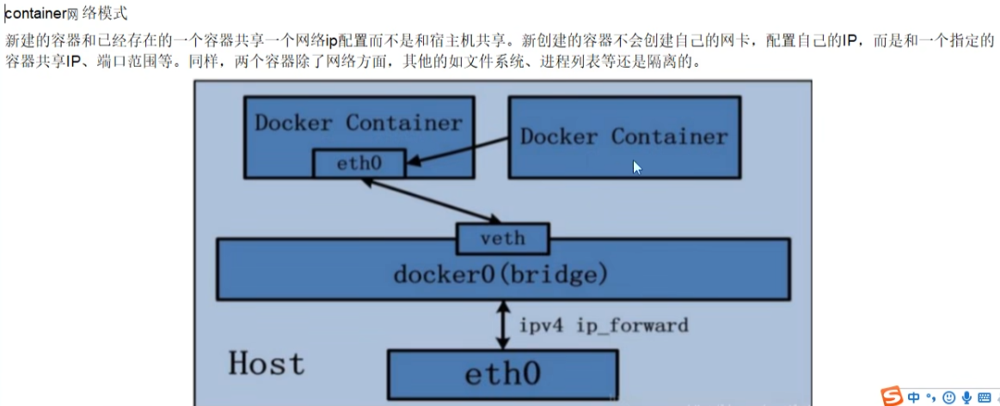

# 案例

## bridge

Docker 服务默认会创建一个 docker0 网桥（其上有一个 docker0 内部接口），该桥接网络的名称为 docker0，它在内核层连通了其他的物理或虚拟网卡。

所有容器和本地主机都放到同一个物理网络。Docker 默认指定了 docker0 接口的 IP 地址和子网掩码，让主机和容器之间可以通过网桥相互通信。

容器内部有etho,与网桥上的veth相匹配





## host

直接使用宿主机的IP地址与外界进行通信，不再需要额外进行NAT转换




容器不会获得一个独立的Networkspace,而是和宿主机公用一个Networkspace,容器将不会虚拟出自己的网卡而是使用宿主机的IP和端口


警告:

```
docker run -d -p 8083:8080 --network host --name tomcate83 billygoo/tomcat8-jdk8
WARNING: Published ports are discarded when using host network mode
```

使用host模式的时候，直接可以不写端口映射，host模式是跟主机共用一个端口


## none

禁用网络功能，只有lo表示(就是127.0.0.1表示本地回环)

```
docker run -d -p 8083:8080 --network none --name tomcate83 billygoo/tomcat8-jdk8
```


## container



实现网络端口共享，当共享源关闭之后，另一个共享者的网络端口将不存在

```
docker run -it                             --name alpine1 alpine /bin/sh
docker run -it --network container:alpine1 --name alpine2 alpine /bin/sh
```


## 自定义网络

维护了主机名和ip的对应关系；