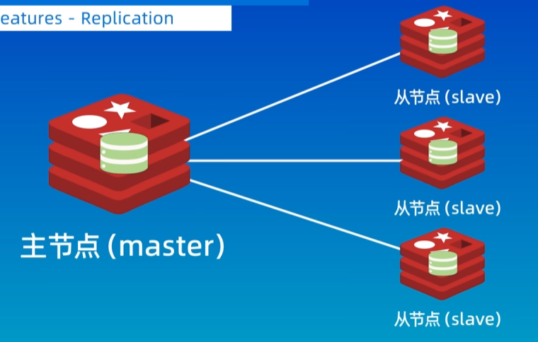
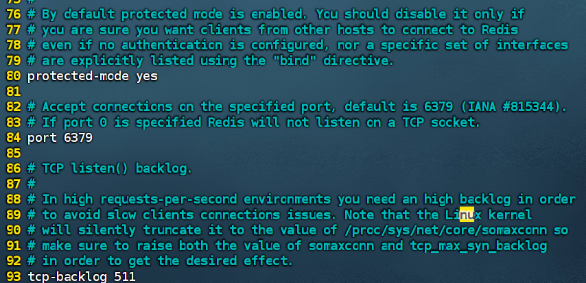
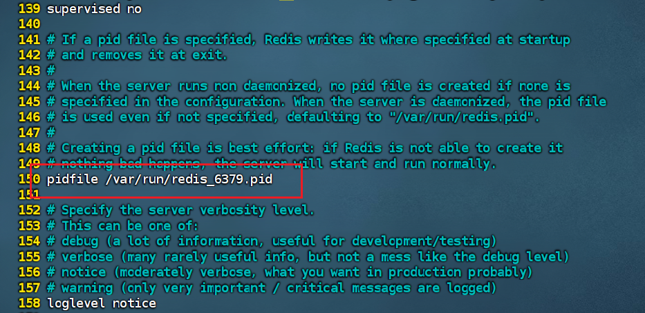
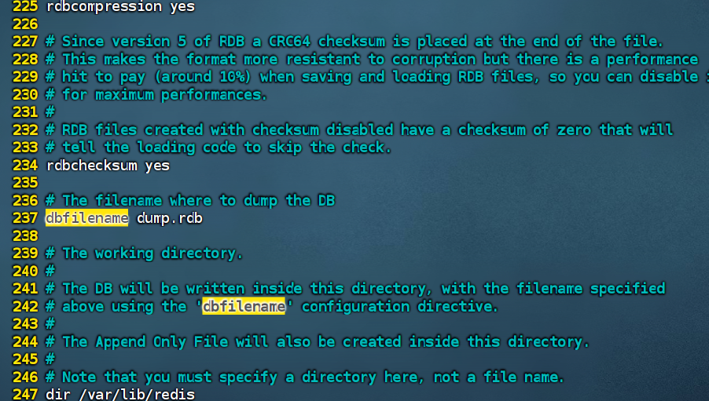
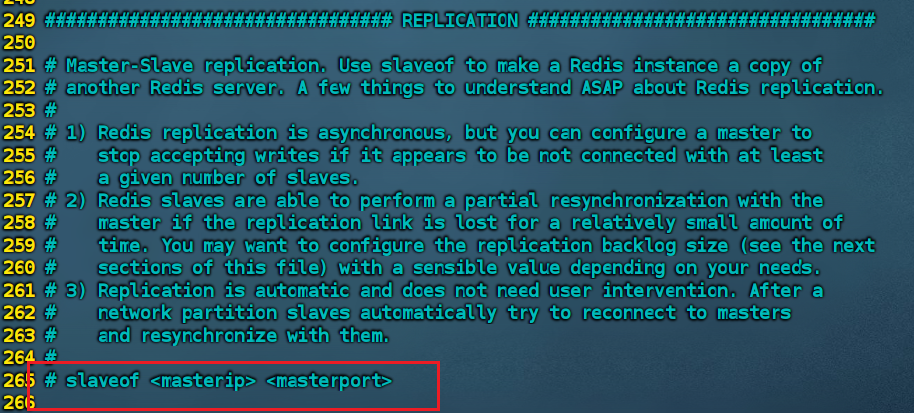
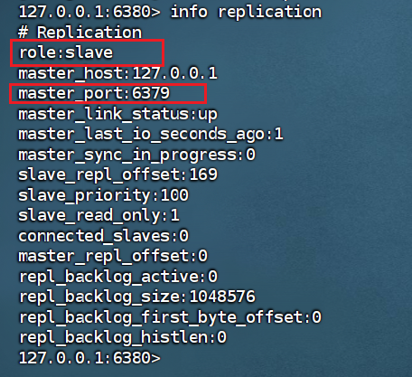
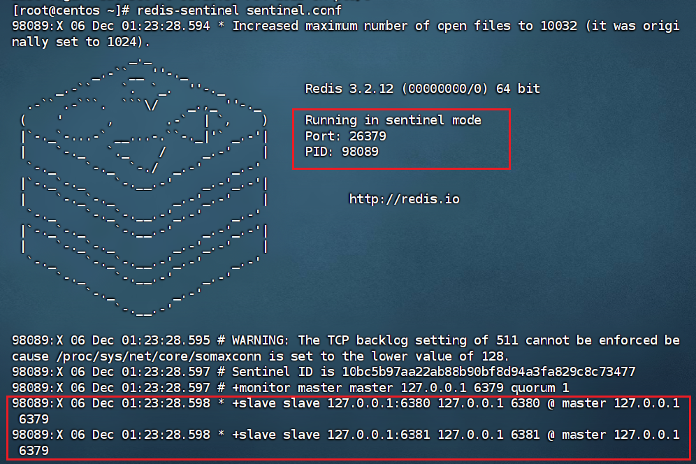
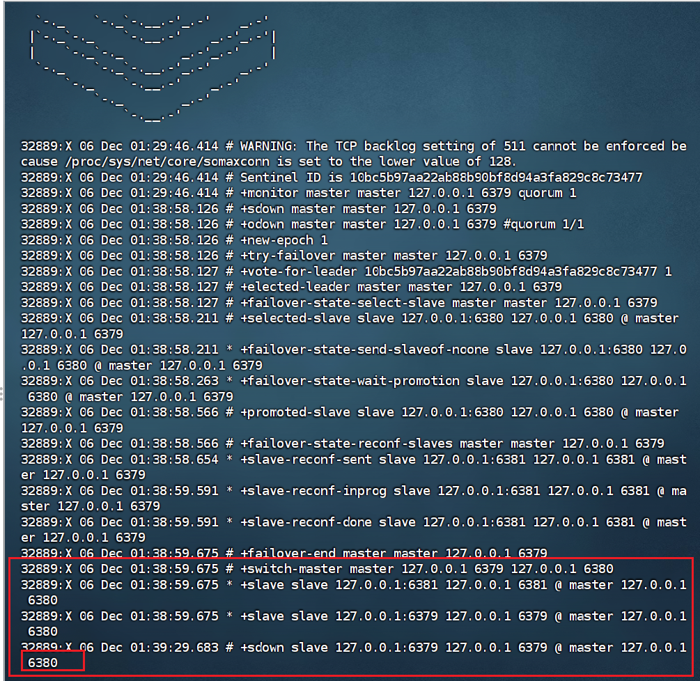
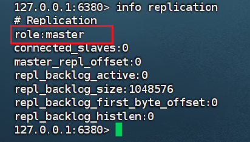
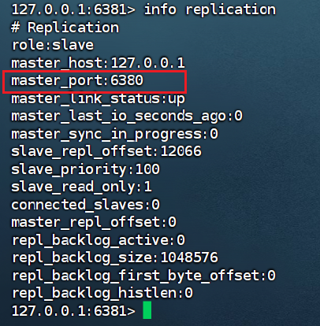

# Redis哨兵模式（Linux）

**哨兵模式**是 Redis 官方推荐的高可用性（HA）解决方案。它通过监控 Redis 主从节点，在主节点故障时**自动完成故障转移**，从而实现 Redis 的高可用性。


了解哨兵模式模式之前，先了解一下主从复制的概念

## 主从复制



一个主节点可以对应多个从节点，但是每个从节点只能有一个主节点。数据的复制是单向的，只能由主节点到从节点。

### 如何设置从节点

这里主要讲解如何使用配置文件来，进行主从节点的设置，一般Redis的配置文件为redis.conf这个文件，一般在/etc文件中

1. 复制一份配置文件到根目录中，在根目录中进行操作

   ```redis
   cp redis.conf ~
   ```

2. 在根目录进行一次复制一份redis-6380.conf的配置文件，作为从节点的配置文件

   ```redis
   cp redis.conf redis-6380.conf
   ```

3. 修改redis-6380.conf配置文件

   改动文件中的几个位置

   端口号：改成你的从节点，我以6380为例

   

​	将这个地方改成6380

​	

​	将这个pidfile后面的端口也改成6380

​	

​	找到dbfilename这个地方，将后面的文件名dump.rdb也加上端口号，dump-6380.rdb

​	

​	然后找到这个地方，有的配置文件可能不同，但是类似，在下面加上


​	表示配置的是6379的从节点

4. 重新打开一个端口，启动该节点

   ```
   redis-server redis-6380.conf
   ```

5. 再启动一个新的客户端，连接该从节点

   ```
   redis-cli -p 6380
   ```

   

6. 查看该从节点信息

   ```
   info replication
   ```

   

​	可以看出该节点是一个从节点，并且主节点端口号是6379


## 设置哨兵

​	相信通过上述，对于从节点的设置已经有了一个清晰的了解了，接下来，我配置了一个一主两从的节点关系，来讲解哨兵模式。（主：6379 从：6380，6381）

1. 首先在redis集群中添加一个哨兵节点，需要添加一个sentinel.conf文件

   内容如下：

   ```
   sentinel monitor master 127.0.0.1 6379 1
   ```

2. 启动哨兵节点：

   ```
   redis-sentinel sentinel.conf
   ```

   

​	可以看出一个运行在26379端口的哨兵模式，下面是两个从节点6380,6381


## 故障转移

在开启哨兵模式之后，如果主节点宕机或出故障了，可以通过故障转移，更换主节点

接下来，模拟一下主节点宕机的情况，展示一下主节点转移的状态

直接在6379端口输入ctrl+c,或者吧终端关闭，来模拟一下端口宕机

```
redis-cli -p 6379 SHUTDOWN
```

关闭端口后，等待几秒



可以看出主节点以及换成了6380端口





两个端口的情况，以及看出6381的主节点已经变成了6380端口

## 哨兵节点的优缺点

### **优点：**

1. **高可用**：自动故障转移，服务不间断
2. **监控全面**：持续监控所有节点状态
3. **自动配置**：客户端自动发现主节点
4. **官方支持**：Redis 官方解决方案

### **缺点：**

1. **配置复杂**：需要部署多个哨兵节点
2. **性能开销**：哨兵间需要通信和选举
3. **脑裂问题**：网络分区可能导致多个主节点
4. **扩容复杂**：不支持自动分片


​	哨兵模式是 Redis 高可用的成熟方案，适合**读多写少、数据量不大**的场景。对于需要水平扩展、大数据量的场景，建议考虑 **Redis Cluster** 集群模式。

**部署建议**：

- 至少3个哨兵节点，部署在不同物理机
- 哨兵节点数量为奇数（3、5、7）
- 定期测试故障转移流程
- 监控哨兵和Redis节点的健康状态


上述就是哨兵模式的大致过程，看完应该对哨兵模式有了一个更加深刻的理解了吧

