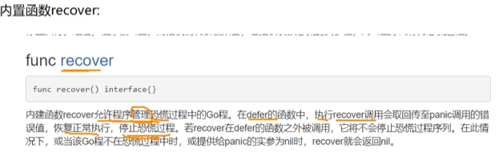

当程序出现错误的时候，程序会被中断执行
>错误的处理：

defer+recover处理机制:
使用内置函数recover:

**代码实现**：
```go
package main

import "fmt"

func main() {
	test()
	fmt.Println("上面的除法正常执行了")
	fmt.Println("正常执行下面的逻辑")
}
func test() {
	//利用defer+recover
	defer func() {
		err := recover()
		//如果没有捕获到零值: nil
		if err != nil {
			fmt.Println("错误已捕获")
			fmt.Println("err是：", err)
		}
	}()
	num1 := 2
	num2 := 0
	result := num1 / num2
	fmt.Println(result)
}

```